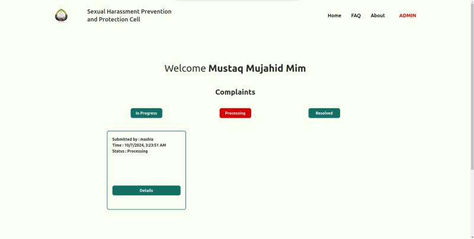
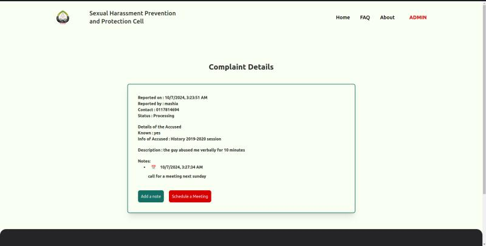
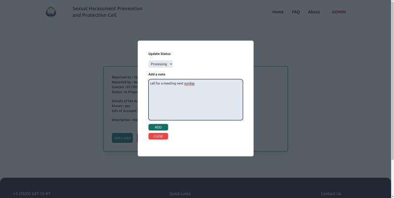

# Sexual Harassment Prevention & Protection Cell

This is the main repository of our CSE-350 project. It has both the frontend and the backend folder but the frontend is deployed in [Vercel](https://vercel.com/). If you hit the [https://shppc-sust.vercel.app/](https://shppc-sust.vercel.app/), it will take you to the homepage.  
  
The backend directory in this folder is maintained for future dockerization purposes. And we have a separate backend repository [CSE350-backend](https://github.com/mmmim24/cse350-backend) deployed in [Railway](https://railway.app).


## About The Project

This project implements a Sexual Harassment Prevention & Protection Cell web application for Shahjalal University of Science & Technology. The platform allows students to submit complaints confidentially, and administrators to manage and track these complaints through resolution.

### Student Homepage


### Admin Homepage


### Key Features

- **Complaint Submission**: Students can submit detailed complaints through a multi-step form
    

- **Tracking System**: Users can track their complaint status using a unique ID
    
- **Admin Dashboard**: Administrators can view, filter, and manage all submitted complaints
    
  
- **Meeting Scheduling**: Admins can schedule meetings related to complaints
    
- **Note Management**: Admins can add notes and update the status of complaints
    
- **Password Management**: Users can change their passwords securely

### Tech Stack

- **Frontend**: React.js with Vite, TailwindCSS
- **Backend**: Node.js, Express.js
- **Database**: MongoDB
- **Authentication**: JWT and bcrypt for password hashing
- **Email Notifications**: Nodemailer for sending email updates
- **PDF Generation**: @react-pdf/renderer for complaint documents

### Design

View our UI/UX design on Figma:
- [SHPPC Design](https://www.figma.com/design/YRHJtSbK9wfC4E3Dqf8VQW/350?m=auto&t=3EnQDzj6WIxun6ap-1)

## Project Structure

- `/frontend`: Contains the React.js frontend application
- `/backend`: Contains the Express.js backend API

>### Institution 
>##### [Shahjalal University of Science & Technology](https://sust.edu)  

>### Members   
> ##### [Mitu Chowdhury](https://github.com/MituChowdhury) : 2019331010
> ##### [S.M. Saifullah](https://github.com/Saif-2019331014): 2019331014
> ##### [Mustaq Mujahid Mim](https://github.com/mmmim24) : 2019331024
> ##### [Ushan Ghosh](https://github.com/UshanGhosh) : 2019331080
> ##### [Mashia Hossain Mim](https://github.com/mashia2019331085): 2019331085

## Installation and Setup

Clone this repository using `git clone https://github.com/mmmim24/CSE350.git`. 

### Frontend Setup

1. Move into the frontend directory:

   ```
   cd CSE350/frontend/Sexual_Harrasment_Prevention_Cell/
   ```

2. Install the dependencies:
   ```
   npm i
   ```

3. Start the development server:
   ```
   npm run dev
   ```
   
4. Access the application at [localhost:5173](http://127.0.0.1:5173) 

   You can modify the default port in [vite.config.js](https://github.com/mmmim24/CSE350/tree/master/frontend/Sexual_Harrasment_Prevention_Cell/vite.config.js) file.

5. To expose your host IP in your network, run:
   ```
   npm run shppc
   ```

### Backend Setup

While the production backend is hosted on Railway, you can set up the backend locally:

1. Navigate to the backend directory:
   ```
   cd CSE350/backend
   ```

2. Install the dependencies:
   ```
   npm i
   ```

3. Create a `.env` file with the following variables:
   ```
   PORT=3333
   MONGODB_URI=mongodb://127.0.0.1:27017/shppc
   PASS=your_email_password_for_nodemailer
   ```

4. Start the backend server:
   ```
   npm start
   ```

## Login Credentials

For testing purposes, you can use the following credentials:

- **Student Account**:
  - Email: `mashia85@student.sust.edu`
  - Password: `2019331085`

- **Admin Account**:
  - Email: `mustaqmujahidmim@gmail.com`
  - Password: `2019331024`

## API Endpoints

The backend provides the following main API endpoints:

- `/user` - User authentication and management
- `/complaint` - Complaint submission and management

## Deployment

- Frontend was deployed on [Vercel](https://shppc-sust.vercel.app/)
- Backend was deployed on [Railway](https://cse350-backend-production.up.railway.app/)


## License

This project is licensed under the MIT License - see the [LICENSE](LICENSE) file for details.
```